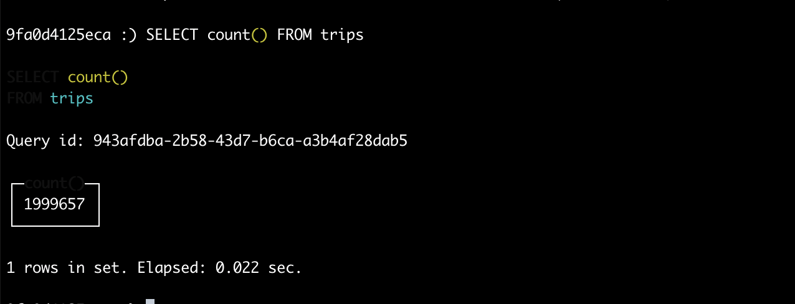
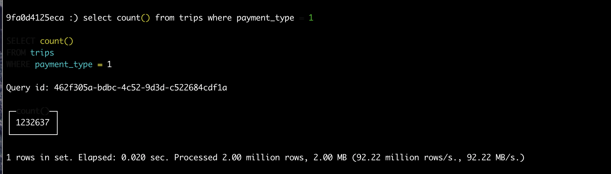
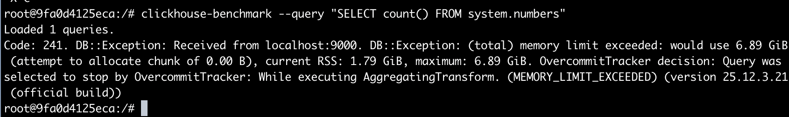

# ДЗ: Установка ClickHouse

1. Запускаем установку тестового стенда:
```
docker-compose up -d
```
2. Подключаемся к контейнеру клиеинта
```
docker exec -it clickhouse-client bash
```
3. Подключаемся с контейнера клиента к хосту сервера с указанием пароля "homework2"
```
clickhouse-client --host clickhouse-server --user default --password
```
4. Создайте следующую таблицу trips в базе данных default [(инфа с оф. сайта)](https://clickhouse.com/docs/ru/tutorial)
```
CREATE TABLE trips
(
    `trip_id` UInt32,
    `vendor_id` Enum8('1' = 1, '2' = 2, '3' = 3, '4' = 4, 'CMT' = 5, 'VTS' = 6, 'DDS' = 7, 'B02512' = 10, 'B02598' = 11, 'B02617' = 12, 'B02682' = 13, 'B02764' = 14, '' = 15),
    `pickup_date` Date,
    `pickup_datetime` DateTime,
    `dropoff_date` Date,
    `dropoff_datetime` DateTime,
    `store_and_fwd_flag` UInt8,
    `rate_code_id` UInt8,
    `pickup_longitude` Float64,
    `pickup_latitude` Float64,
    `dropoff_longitude` Float64,
    `dropoff_latitude` Float64,
    `passenger_count` UInt8,
    `trip_distance` Float64,
    `fare_amount` Float32,
    `extra` Float32,
    `mta_tax` Float32,
    `tip_amount` Float32,
    `tolls_amount` Float32,
    `ehail_fee` Float32,
    `improvement_surcharge` Float32,
    `total_amount` Float32,
    `payment_type` Enum8('UNK' = 0, 'CSH' = 1, 'CRE' = 2, 'NOC' = 3, 'DIS' = 4),
    `trip_type` UInt8,
    `pickup` FixedString(25),
    `dropoff` FixedString(25),
    `cab_type` Enum8('yellow' = 1, 'green' = 2, 'uber' = 3),
    `pickup_nyct2010_gid` Int8,
    `pickup_ctlabel` Float32,
    `pickup_borocode` Int8,
    `pickup_ct2010` String,
    `pickup_boroct2010` String,
    `pickup_cdeligibil` String,
    `pickup_ntacode` FixedString(4),
    `pickup_ntaname` String,
    `pickup_puma` UInt16,
    `dropoff_nyct2010_gid` UInt8,
    `dropoff_ctlabel` Float32,
    `dropoff_borocode` UInt8,
    `dropoff_ct2010` String,
    `dropoff_boroct2010` String,
    `dropoff_cdeligibil` String,
    `dropoff_ntacode` FixedString(4),
    `dropoff_ntaname` String,
    `dropoff_puma` UInt16
)
ENGINE = MergeTree
PARTITION BY toYYYYMM(pickup_date)
ORDER BY pickup_datetime;
```
5. Добавляем набор данных, делаем вставку из 2 000 000 строк в нашу таблицу trips из двух разных файлов S3: trips_1.tsv.gz и trips_2.tsv.gz:
```
INSERT INTO trips
SELECT * FROM s3(
    'https://datasets-documentation.s3.eu-west-3.amazonaws.com/nyc-taxi/trips_{1..2}.gz',
    'TabSeparatedWithNames', "
    `trip_id` UInt32,
    `vendor_id` Enum8('1' = 1, '2' = 2, '3' = 3, '4' = 4, 'CMT' = 5, 'VTS' = 6, 'DDS' = 7, 'B02512' = 10, 'B02598' = 11, 'B02617' = 12, 'B02682' = 13, 'B02764' = 14, '' = 15),
    `pickup_date` Date,
    `pickup_datetime` DateTime,
    `dropoff_date` Date,
    `dropoff_datetime` DateTime,
    `store_and_fwd_flag` UInt8,
    `rate_code_id` UInt8,
    `pickup_longitude` Float64,
    `pickup_latitude` Float64,
    `dropoff_longitude` Float64,
    `dropoff_latitude` Float64,
    `passenger_count` UInt8,
    `trip_distance` Float64,
    `fare_amount` Float32,
    `extra` Float32,
    `mta_tax` Float32,
    `tip_amount` Float32,
    `tolls_amount` Float32,
    `ehail_fee` Float32,
    `improvement_surcharge` Float32,
    `total_amount` Float32,
    `payment_type` Enum8('UNK' = 0, 'CSH' = 1, 'CRE' = 2, 'NOC' = 3, 'DIS' = 4),
    `trip_type` UInt8,
    `pickup` FixedString(25),
    `dropoff` FixedString(25),
    `cab_type` Enum8('yellow' = 1, 'green' = 2, 'uber' = 3),
    `pickup_nyct2010_gid` Int8,
    `pickup_ctlabel` Float32,
    `pickup_borocode` Int8,
    `pickup_ct2010` String,
    `pickup_boroct2010` String,
    `pickup_cdeligibil` String,
    `pickup_ntacode` FixedString(4),
    `pickup_ntaname` String,
    `pickup_puma` UInt16,
    `dropoff_nyct2010_gid` UInt8,
    `dropoff_ctlabel` Float32,
    `dropoff_borocode` UInt8,
    `dropoff_ct2010` String,
    `dropoff_boroct2010` String,
    `dropoff_cdeligibil` String,
    `dropoff_ntacode` FixedString(4),
    `dropoff_ntaname` String,
    `dropoff_puma` UInt16
") SETTINGS input_format_try_infer_datetimes = 0
```

6. Убеждаюсь, что все прошло успешно:
```
SELECT count() FROM trips
```

7. Вывод команды из дз
```
select count() from trips where payment_type = 1
```

8. Вывод конфигурационных файлов
```
docker exec -it clickhouse-server  cat /etc/clickhouse-server/config.xml
docker exec -it clickhouse-server  cat /etc/clickhouse-server/users.xml
```
9. Производительность установки
```
 clickhouse-benchmark --query "SELECT count() FROM system.numbers"
```


Далее оптимизацию сложно провести, так как данная тема на занятии не была раскрыта, бест практиса и рекомендаций по конкретным параметрам ни в презентации, ни на занятии, к сожалению, раскрыто не было, поэтому считаю на этом этапе дз выполненным.
